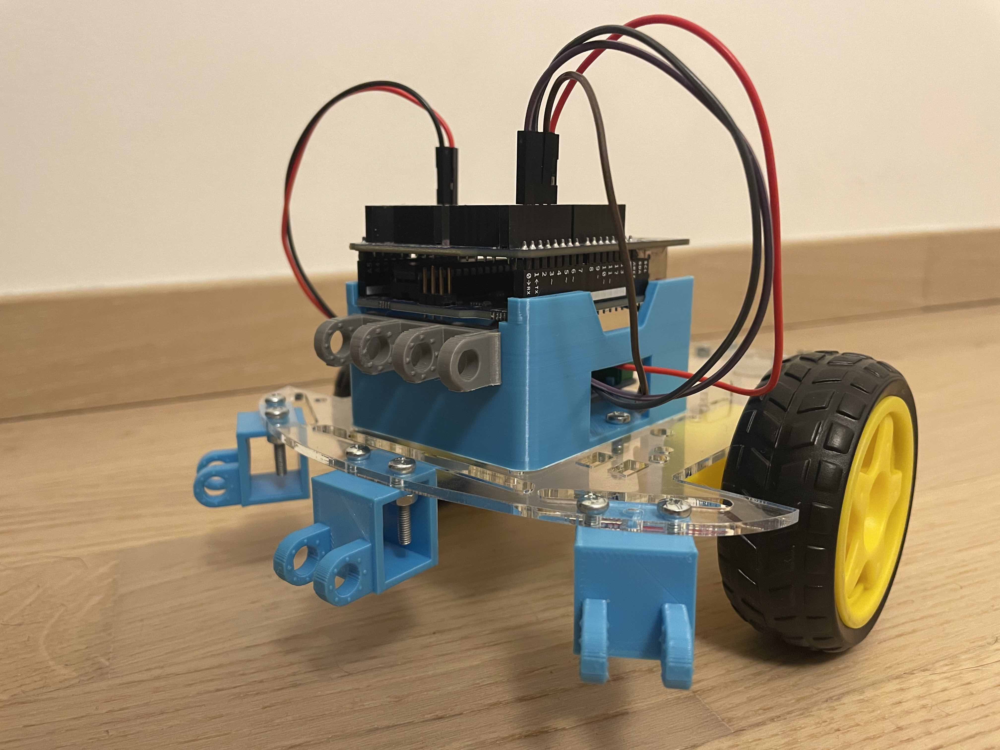

# LOCORover

LOCORover is an open-source robotics platform designed for teaching the basics of Arduino robotics. It is built from standard low-cost electronic components and some custom 3D-printable parts. The platform is designed in a modular way, making it possible to assemble various configurations of wheeled robots. We provide examples of several such configurations, including assembly instructions and starter code.

## SMARS

LOCORover's design is heavily influenced by the wonderful [SMARS](https://www.thingiverse.com/thing:2662828) robot. In fact, the add-on mounts are compatible with SMARS. This means that you can easily use most of the numerous third-party extensions, for example [the drawing tool](https://cults3d.com/en/3d-model/gadget/drawing-tool-dlc-for-smars), [the robot arm](https://www.thingiverse.com/thing:2817517) or [the bumper](https://www.thingiverse.com/thing:3010194).

## Part list

## Examples

## Power supply